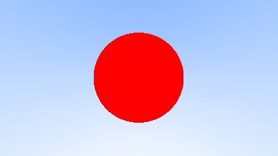
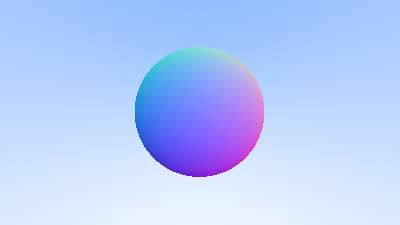

# RayTracingWeekend

# Chapters 
The individual chapter programs within the raytacing book are numbered based on the listing number of the code in https://raytracing.github.io/books/RayTracingInOneWeekend.html. You can find the code in `test/chapters` directory.

## `test/chapters/01_imagegradient.jl`

## `test/chapters/09_skycolor.jl`

## `test/chapters/10_sphere.jl`

## `test/chapters/11_spherenormal.jl`

## `test/chapters/24_twospheres.jl`

## `test/chapters/30_antialiasing.jl`

## `test/chapters/40_diffusion.jl`

