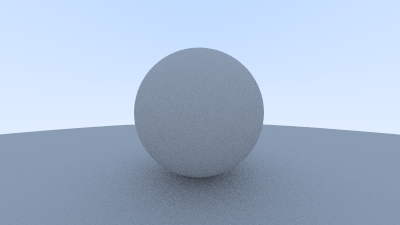

# RayTracingWeekend

# Chapters 
The individual chapter programs within the raytacing book are numbered based on the listing number of the code in https://raytracing.github.io/books/RayTracingInOneWeekend.html. You can find the code in `test/chapters` directory.

Benchmarks were done on my PC with AMD Ryzen 7 5800X 8-Core Processor.

## [test/chapters/01_imagegradient.jl](test/chapters/01_imagegradient.jl)

Benchmark: `254.407 μs (2 allocations: 768.05 KiB)`

## [test/chapters/09_skycolor.jl](test/chapters/09_skycolor.jl)

Benchmark: `788.809 μs (2 allocations: 1.03 MiB)`

## [test/chapters/10_sphere.jl](test/chapters/10_sphere.jl)

Benchmark: `1.683 ms (2 allocations: 1.03 MiB)`

## [test/chapters/11_spherenormal.jl](test/chapters/11_spherenormal.jl)

Benchmark: `1.686 ms (2 allocations: 1.03 MiB)`

## [test/chapters/24_twospheres.jl](test/chapters/24_twospheres.jl)

Benchmark: `7.265 ms (720004 allocations: 20.26 MiB)`

## [test/chapters/30_antialiasing.jl](test/chapters/30_antialiasing.jl)

Benchmark: `932.870 ms (72000004 allocations: 1.88 GiB)`

## [test/chapters/40_diffusion.jl](test/chapters/40_diffusion.jl)

Benchmark: `1.837 s (130016420 allocations: 3.39 GiB)`

## [test/chapters/50_metal.jl](test/chapters/50_metal.jl)

Benchmark: `4.748 s (333183134 allocations: 7.80 GiB)`

## [test/chapters/60_dielectrics.jl](test/chapters/60_dielectrics.jl)

Benchmark: `6.899 s (485701411 allocations: 11.07 GiB)`

## [test/chapters/63_new_camera.jl](test/chapters/63_new_camera.jl)

Benchmark: `2.074 s (137304900 allocations: 3.58 GiB)`

## [test/chapters/64_distant_view.jl](test/chapters/64_distant_view.jl)

Benchmark: `8.151 s (554879562 allocations: 12.65 GiB)`

## [test/chapters/68_defocus_blur.jl](test/chapters/68_defocus_blur.jl)

Benchmark: `6.316 s (446907564 allocations: 10.19 GiB)`

## [test/chapters/70_final_scene.jl](test/chapters/70_final_scene.jl)

Benchmark (used time here, instead of btime): ``

